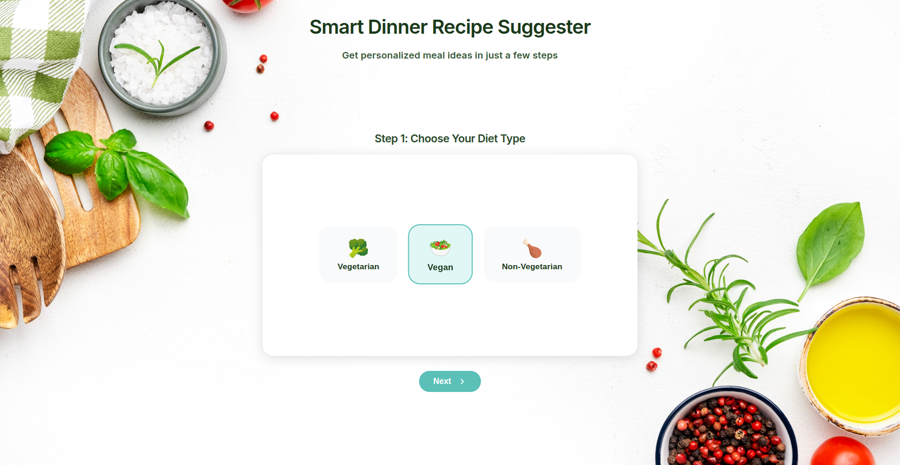
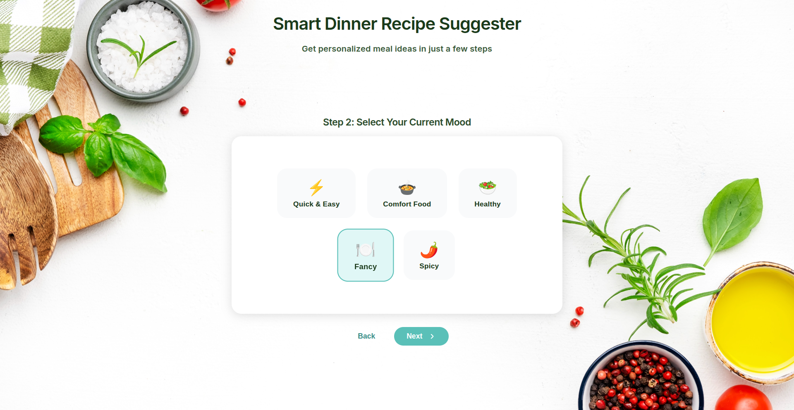
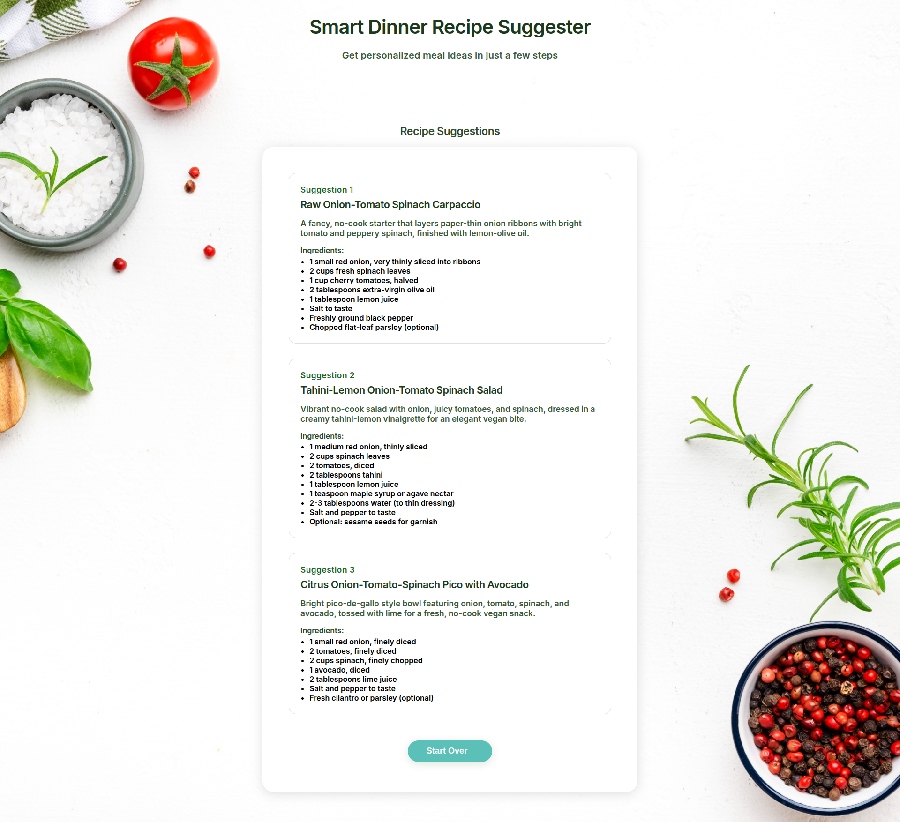

# Smart Dinner

Get personalized meal ideas in just a few steps! Smart Dinner is a modern, responsive web app that suggests recipes based on your diet, mood, cooking method, and available ingredients.

## Live Demo

[https://smartdinner.marnitzmalan.com/](https://smartdinner.marnitzmalan.com/)

## Screenshots

	
	
	
    

## Features

- Multi-step recipe suggestion flow
- Select diet type, mood, and preferred cooking method
- Multi-select for ingredients to include/exclude
- AI-powered recipe suggestions from a backend API
- Responsive, mobile-friendly design
- Easy "Start Over" to try new combinations
- Fast, modern UI with beautiful visuals

## Tech Stack

### Frontend
- Angular 20 (standalone components, signals)
- TypeScript
- SCSS (modular, responsive)
- Deployed on Railway

### Backend

[https://github.com/MarnitzDev/smart-dinner-be](https://github.com/MarnitzDev/smart-dinner-be/)

---
Made with ❤️ by Marnitz Malan
